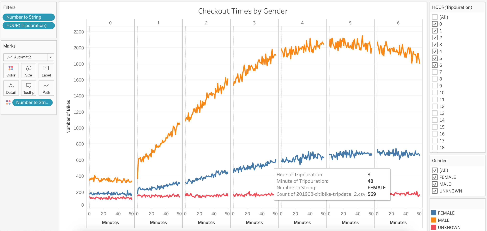
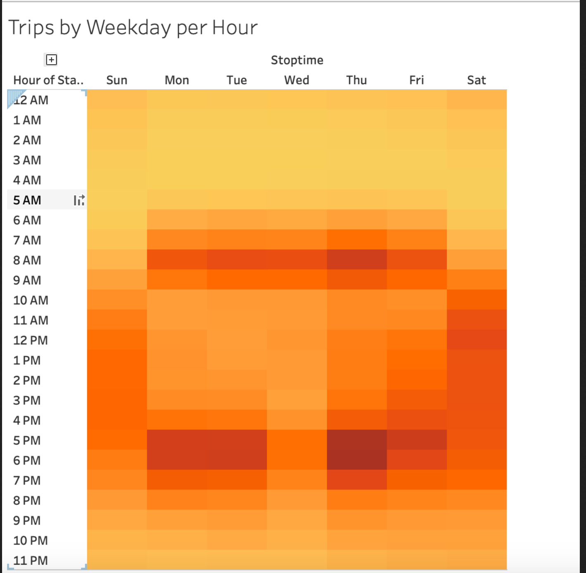
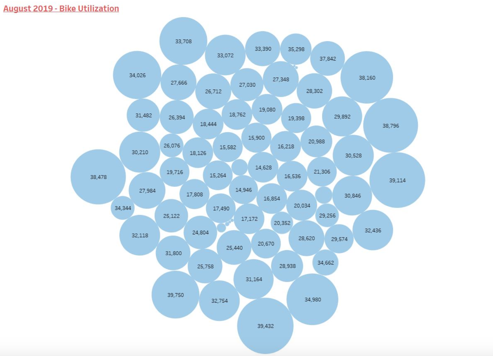
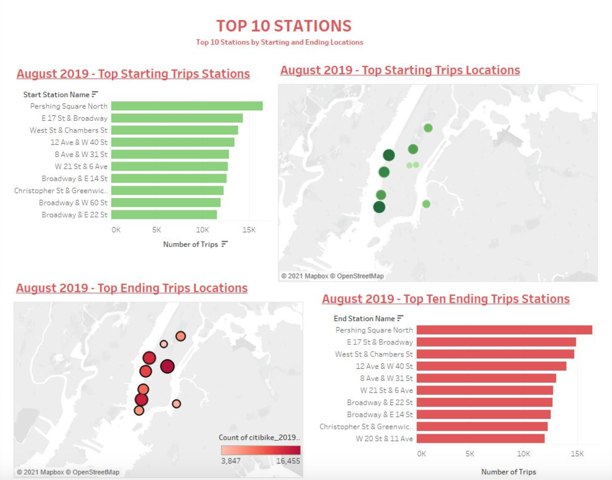

# bikesharing

# Deliverable 1: Change Trip Duration to a Datetime Format

**Deliverable 1 Requirements**

The data in the "tripduration" column is converted to a datetime datatype and has the correct time format

The DataFrame is exported as a new file without the index column

# Deliverable 2: Create Visualizations for the Trip Analysis

**Deliverable 2 Requirements**

There is a line graph displaying the number of bikes checked out by duration for all users, and the graph can be filtered by the hour

There is a line graph displaying the number of bikes that are checked out by duration for each gender by the hour, and the graph can be filtered by the hour and gender

A heatmap is created showing the number of bike trips for each hour of each day of the week

A heatmap is created showing the number of bike trips by gender for each hour of each day of the week, and the heatmap can be filtered by gender

A heatmap is created showing the number of bike trips for each type of user and gender for each day of the week, and you can only filter by user and gender

# Deliverable 3: Create a Story and Report for the Final Presentation

**Deliverable 3 Requirements**

The purpose of the analysis is well defined.

Results:

There are at least seven visualizations for the NYC Citibike analysis
        
There is a description of the results for each visualization

Summary:

There is a high-level summary of the results and two additional visualizations are suggested for future analysis
